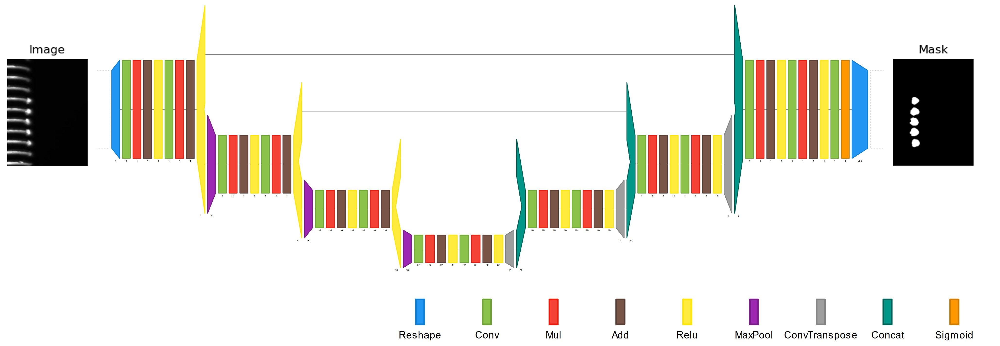
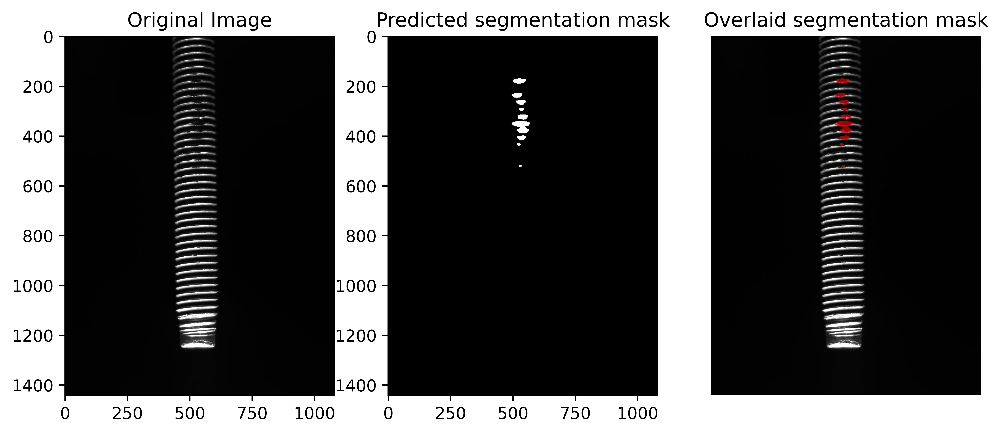
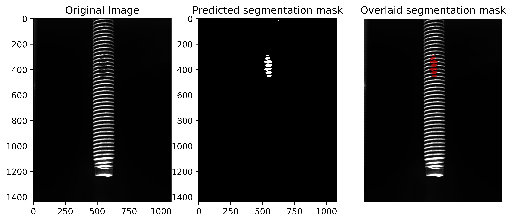
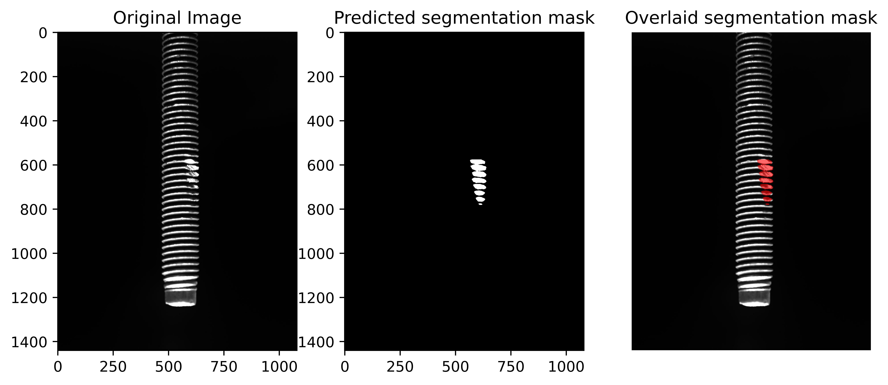
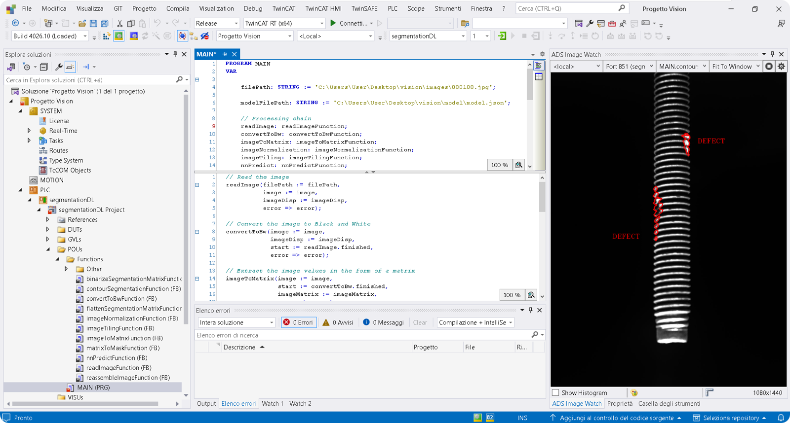

# TwinCAT Screw Defect Segmentation U-Net

Development and integration of a Deep Learning trained in Python model for defect segmentation on screw components, deployed within the Beckhoff TwinCAT environment.

## Overview

This project focuses on the detection and segmentation of manufacturing defects on screw components using a convolutional neural network (U-Net), trained in Python and integrated into TwinCAT for industrial use.

## 1. Dataset

- **Source:** [VISION Datasets: A Benchmark for Vision-based InduStrial InspectiON](https://arxiv.org/abs/2306.07890), by H. Bai et al.
- **Subset Used:** Screw dataset  
- **Content:** High-resolution images (1080x1920) of screws with annotated manufacturing defects  
- **Annotations:** Provided in COCO format  

## 2. Deep Learning Model

- **Main frameworks:** Python, TensorFlow Keras  
- **Architecture:** U-Net  
- **Export Format:** ONNX (Open Neural Network Exchange) for TwinCAT compatibility

### 2.1 Training

- **Supervised Training**
- **Loss Function:** Dice loss
- **Metrics:** Intersection Over Union (IoU)
- **Data augmentation**: Overlapping patch extraction, random brightness, random rotations, random contrast adjustments
- **Early Stopping:** Training stops if the IoU score on the validation set did not improve for 20 consecutive epochs

### 2.2 Inference

- The trained model is then used on unseen, non-annotated images  
- Each image is split into 25 non-overlapping patches  
- Each patch is processed by the model to generate a segmentation mask  
- The individual masks are then recombined into a final segmentation output

Additional images for the model predicitons are available in: "Python Code/Predictions"

## 3 TwinCAT Integration

### 3.1 TC3 Vision (TF7100)

- Image loading and processing
- Contour detection and post-processing (artifact removal)
- Final result visualization

### 3.2 TC3 Machine Learning Server (TF3820)

- Asynchronous inference using ONNX model
- Model management via TwinCAT Machine Learning Manager

## Author

**Luca Subitoni**
